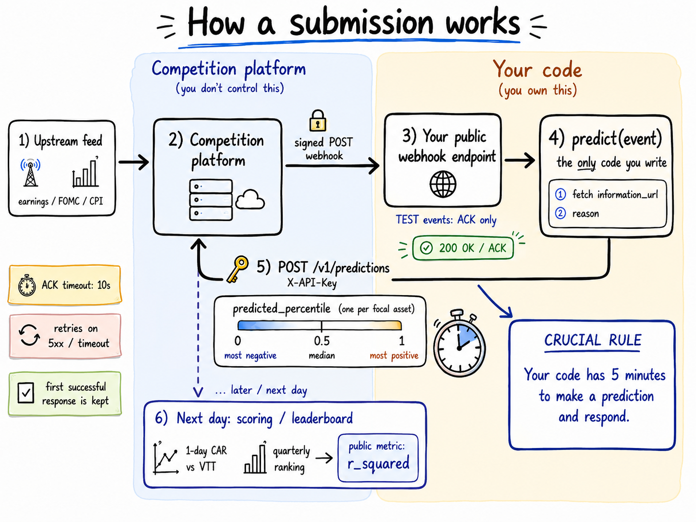

# Explaining Markets — Modal starter

<p align="center">
  
</p>

A minimal [Modal](https://modal.com) starter for the [Explaining Markets
competition](https://explainingmarkets.ai/). Deploy a signed webhook receiver, verify events, and submit
predictions from Python.

**Edit `predict.py`. Everything else is plumbing.**

```
predict.py                 ← your strategy lives here
modal_app.py               ← FastAPI app + webhook handler (don't touch)
src/explaining_markets/    ← config, verifier, API client, helpers (plumbing)
tests/                     ← predict shape + webhook verification
```

When an event fires, the competition sends a **signed webhook** to your URL. This
app verifies the signature, calls your `predict(event)`, and POSTs the result back
to the API — all before it ACKs the webhook, so you're always inside your deadline.

---

## Prerequisites

This repo uses [uv](https://docs.astral.sh/uv/) — install it from the
[uv installation guide](https://docs.astral.sh/uv/getting-started/installation/).

> **Prefer pip?** Run `python -m venv .venv && source .venv/bin/activate && pip install -e ".[dev]"`
> instead of `uv sync`, and drop the `uv run` prefix from every command below.

## Quickstart

### 0. Install and sign in to Modal

```bash
uv sync
```

If you're new to Modal, create a free account and authenticate (one time — skip if
you already have a Modal token on this machine):

```bash
uv run modal setup
```

### 1. Create an account and your first submission

Go to [Explaining Markets](https://portal-beta.explainingmarkets.ai) and click
**Sign in** at the top right, then **Create an account**, and complete the
sign-up flow.

Once you're in, create a submission from the
[Submissions](https://portal-beta.explainingmarkets.ai/submissions) page and
give it a public name. You'll land on its **Overview** tab, which has a
**Setup checklist** that walks you through the rest:

> **Credentials → Webhook URL → Submission is live → Verify your endpoint works**

The next steps map onto that checklist; the submission goes live automatically once
the first two are done.

### 2. Initialize credentials (checklist: *Credentials*)

Click **Initialize credentials** (the checklist's first item) to mint your **API
key** and **webhook signing secret**. A dialog shows them **once**, under the
heading *"Ready to paste into .env"*, already formatted — exactly the two lines this
starter needs:

> `EM_API_KEY=...`
>
> `EM_WEBHOOK_SECRET=whsec_...`

Click **Copy** (the dialog won't let you continue until you do) — you won't see
these again, so don't close it before the next step. (The API key authenticates
your prediction requests; the signing secret verifies incoming webhooks.)

**Note:** If you ever need new credentials — e.g., because they were accidentally
leaked — that same item becomes **Replace credentials**. Clicking it mints a new set
you can use to continue from **Step 3**.

### 3. Put your credentials in `.env`

Create your `.env` from the template, then paste the copied box into it, replacing
the two placeholder lines:

```bash
cp .env.example .env
```

That's the whole secret setup — Modal reads `.env` automatically at deploy time, so
there's no command to run. (`.env` is gitignored; never commit it. Add
`OPENAI_API_KEY` here too if you want real LLM predictions instead of the baseline.)

### 4. Deploy

```bash
uv run modal deploy modal_app.py
```

Modal prints a persistent public URL like
`https://<your-workspace>--explaining-markets.modal.run`. **That URL is your webhook
URL — copy it as-is, nothing to append.** The deployment keeps running after you
close your laptop.

### 5. Set your webhook URL, go live, and verify

Back on the Overview checklist, do **Webhook URL**: paste the URL from the previous
step (it must be reachable over HTTPS in production; `http://` is allowed in dev)
and click **Save webhook URL**. As soon as credentials and a URL are both set,
**Submission is live** flips on automatically — no extra action.

The last item, **Verify your endpoint works**, is optional but recommended. Click
**Send test event** to send a synthetic delivery. Your handler verifies it, sees
`event_type == "TEST"`, and ACKs with 200 without submitting; the checklist then
shows *"Your endpoint responded successfully."* If it doesn't appear right away,
check the **Health** tab for rolling delivery counters.

### 6. Edit `predict.py`

This is the only file you edit. `predict(event)` is called once per event after
verification; return one prediction per focal asset:

```python
def predict(event: dict) -> list[dict]:
    return [
        {"identifier_value": "AAPL", "predicted_percentile": 0.92},
    ]
```

`predicted_percentile` is a float in `[0, 1]` — your prediction of how the
asset's next-day abnormal (market-adjusted) return will rank across **all of the
quarter's event outcomes**: 0 = the quarter's most negative reaction, 0.50 =
median, 1 = its most positive. It's a cross-sectional rank across the quarter's
events, *not* a percentile within the asset's own history. The default
implementation asks an OpenAI model for a calibrated percentile; with no
`OPENAI_API_KEY` set it returns `0.5` so the round-trip works before you plug in
your real model.

Re-deploy after editing:

```bash
uv run modal deploy modal_app.py
```

Only your first submission for an event is scored — re-POSTing the same event is
accepted but won't overwrite it, so get it right the first time.

---

## Run the tests

```bash
uv run pytest
```

Both suites run fully offline — no API key, no network. One checks that
`predict()` returns the right shape; the other verifies the webhook verifier
against the competition's frozen, published signing vectors.

---

## Troubleshooting

Webhook signatures cover the **exact bytes** the server sent. The most common
mistakes (all handled correctly by `modal_app.py`, but worth knowing if you
customize it):

- **Re-serializing the body before verification.** `json.dumps(json.loads(body))`
  reorders keys and adds spaces — verification fails. Always verify the raw bytes.
- **Using `request.json()` instead of `request.body()`.** Same issue: the parsed
  dict is no longer the original byte string. The handler reads `await
  request.body()`.
- **Ignoring the timestamp.** The verifier defaults to a 5-minute tolerance. If
  your clock drifts, pass `tolerance_seconds=` to `verify_webhook`.
- **Not deduping on `Webhook-Id`.** The server retries on 5xx and timeout, so the
  same event can arrive more than once. This app dedupes via a `modal.Dict`.

If predictions aren't landing: confirm your `.env` has `EM_API_KEY` and
`EM_WEBHOOK_SECRET` filled in (then re-deploy so Modal reloads it), that the
submission shows as live (the checklist's **Submission is live** item), and that
you pasted the deploy URL into the portal. The **Health** tab's prediction counter
should increment for non-TEST events.

If `modal deploy` errors that it can't find `.env`, you're missing the file —
`cp .env.example .env` and fill it in. Modal needs it present at deploy time.

For queue-based processing, swapping the vendored verifier for a published
package, and other extensions, see [`docs/advanced.md`](docs/advanced.md).
